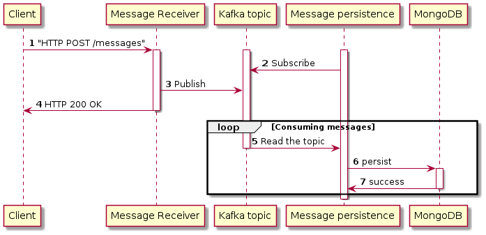

# Homework

This project contains the solution of a homework excercise.

## The excercise

The task is to implement a data processing pipeline in the cloud.
* Set up a running environment with the technologies mentioned below.
* A Readme file containing information you deem useful for someone getting to
know your code and want to try the system out.
* Develop the application in Java 11, based on Spring Boot as a foundation.
* A REST API
    * An endpoint is taking a JSON payload, and publishes it to a PubSub topic
on REDIS or a similar tool of your choice. The endpoint must reject invalid
payloads. Payload structure:
    ```json
    {
    "content": "abrakadabra",
    "timestamp": "2018-10-09 00:12:12+0100"
    }
    ```
    * A PubSub topic consumer is implemented, that persists the freshly received JSON payload to the database.
    * The received JSON payload must also be broadcasted to listening browser clients via Websockets.
    * An endpoint to retrieve all messages persisted from the database; the entities must be enriched with the longest_palindrome_size property, that contains the length of the longest palindrome contained within the value of the content property.
    ```json
    [
    {
    "content": "abrakadabra",
    "timestamp": "2018-10-08 23:12:12+0000",
    "longest_palindrome_size": 3
    }
    ]
    ```
    When computing palindrome length, only alphabetic characters are considered. https://en.wikipedia.org/wiki/Palindrome

* A simple HTML page is implemented to show the real time message delivery.

## The solution

### Architecture

The implementation of this excercise can be a microservices architecture with the following software components:
* Message Receiver Microservice
    * Provides "An endpoint is taking a JSON payload, and publishes it to a PubSub topic on REDIS or a similar tool of your choice"
* Kafka topic as PubSub implementation
    * Provides the PubSub topic of my choice
* Message Persistence Microservice
    * Provides "A PubSub topic consumer is implemented, that persists the freshly received JSON payload to the database"
* MongoDB as persistence layer
    * The database
* Message Lister Microservice
    * Provides "An endpoint to retrieve all messages persisted from the database; the entities must be enriched with the longest_palindrome_size property"

### Business analysis

#### The workflows

##### Message persistence

The tasks in this workflow are:
* Provide a REST endpoint to take the messages in JSON payload
* Provide a PubSub topic
* Publish the incoming JSON payloads to the topic
* Provide a database component to store the messages somewhere
* Provide a consumer on the topic which reads the topic and persists the messages to the database

##### Sequence diagram:


##### Message listing

The tasks in this workflow are:
* Query the messages from the DB
* Do max length palindrom calculation
* Response the message list enriched with the calculated length

